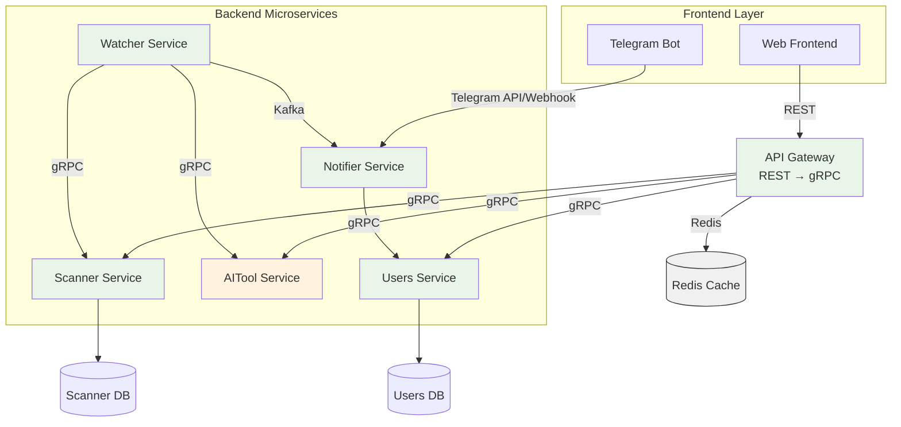

# FinanceAnalyst

Приложение для анализа графиков ценных бумаг на основе аналогичных паттернов в прошлом. Сервис находит соответствующие сегменты графика и предоставляет прогнозы с использованием ML.

## Основная функциональность

- **Сравнение графиков**: Находит похожие исторические паттерны для текущего графика ценной бумаги
- **Уведомления**: Автоматически оповещает пользователей при обнаружении значительных совпадений
- **AI-анализ**: Добавляет машинное обучение для улучшения прогнозов
- **Веб-интерфейс**: Отображает топ ценных бумаг с наибольшим количеством совпадений
---
## Архитектура системы

---
## Микросервисы
### Scanner Service (Go)
Назначение: Поиск похожих графических паттернов в исторических данных

Функциональность:

 - Принимает сегмент графика для анализа

 - Ищет совпадения в базе исторических данных

 - Возвращает массив похожих сегментов графиков с метриками схожести

 - Сохраняет уже посчитанные случаи в базу данных

Оптимизирован для высокопроизводительных вычислений

Интерфейсы:

 - **gRPC**: Основной API для внутренних сервисов

### Watcher Service (Go)
Назначение: Мониторинг ценных бумаг и обнаружение паттернов

Функциональность:

 - Постоянный мониторинг списка ценных бумаг

 - Анализ графиков в реальном времени

 - Определение значительных совпадений с историческими данными

 - Инициирование уведомлений при обнаружении паттернов

Интерфейсы:

 - **gRPC**: Коммуникация с Scanner и AITool

 - **Kafka**: Асинхронная отправка уведомлений

### Notifier Service (Go)
Назначение: Доставка уведомлений пользователям

Функциональность:

 - Обработка сообщений из Kafka

 - Формирование персонализированных уведомлений

 - Интеграция с Telegram API через Webhook

Интерфейсы:

 - **Kafka**: Получение уведомлений от Watcher

 - **Telegram API**: Отправка сообщений пользователям

 - **gRPC**: Запросы к Users Service

### AITool Service (Python)
Назначение: ML-анализ графиков и прогнозирование

Функциональность:

 - Анализ графических паттернов с помощью ML-моделей

 - Генерация прогнозов на основе исторических данных

 - Обучение и обновление моделей

Предоставление AI-инсайтов

Интерфейсы:

 - **gRPC**: Основной API для других сервисов

### Users Service (Go)
Назначение: Управление пользователями и их предпочтениями

Функциональность:

 - Регистрация пользователей через Telegram бота

 - Управление настройками уведомлений

 - Хранение пользовательских данных

 - Аутентификация и авторизация

Интерфейсы:

 - **gRPC**: API для других сервисов

### API Gateway (Go)
Назначение: Единая точка входа для фронтенда

Функциональность:

 - Использует Redis для кеширования частых запросов.

 - Маршрутизация запросов к соответствующим сервисам

 - Агрегация данных из нескольких источников

**TODO**

 - Rate limiting и аутентификация

---

## Технологии
 - Backend: Go, Python

 - Frontend: 

 - Брокер сообщений: Apache Kafka

 - Базы данных: PostgreSQL, Redis

 - Коммуникация: gRPC, REST API

 - ML:

 - Контейнеризация: Docker
