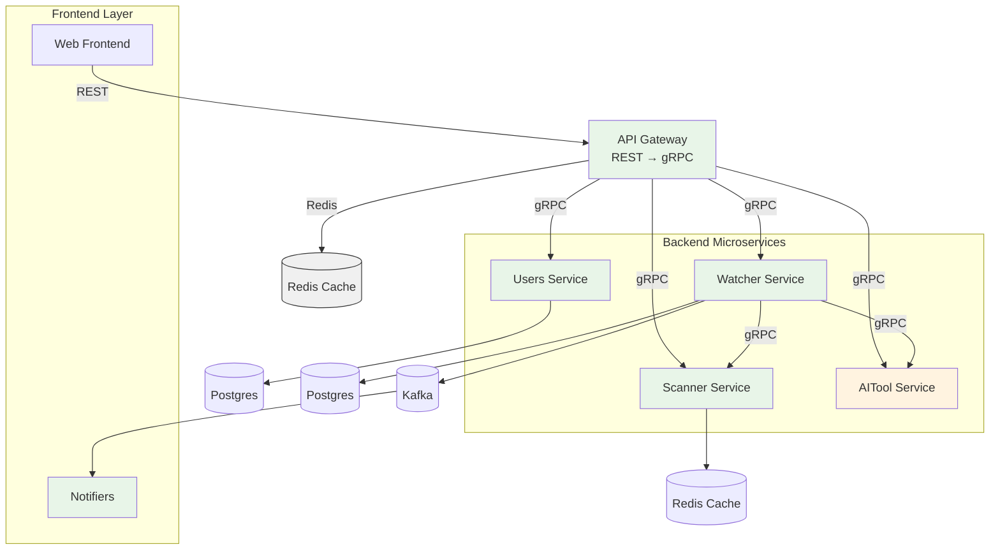

# FinanceAnalyst

Приложение для анализа графиков ценных бумаг на основе аналогичных паттернов в прошлом. Сервис находит соответствующие сегменты графика и предоставляет прогнозы с использованием ML.

## Основная функциональность

- **Сравнение графиков**: Находит похожие исторические паттерны для текущего графика ценной бумаги
- **Уведомления**: Автоматически оповещает пользователей при обнаружении значительных совпадений
- **AI-анализ**: Добавляет машинное обучение для улучшения прогнозов
- **Веб-интерфейс**: Отображает топ ценных бумаг с наибольшим количеством совпадений
---
## Архитектура системы

```mermaid
graph TB
    %% Frontend section
    subgraph "Frontend Layer"
        NT[Notifiers]
        FE[Web Frontend]
    end

    %% API Gateway
    GW[API Gateway<br/>REST → gRPC]
    
    %% Backend Services
    subgraph "Backend Microservices"
        SC[Scanner Service]
        WT[Watcher Service]
        AI[AITool Service]
        US[Users Service]
    end
    
    %% Data Layer
    DB1[(Redis Cache)]
    DB2[(Postgres)]
    DB3[(Postgres)]
    REDIS[(Redis Cache)]
    KAFKA[(Kafka)]
    
    %% Connections
    FE -->|REST| GW
    
    GW -->|gRPC| SC
    GW -->|gRPC| AI
    GW -->|gRPC| US
    GW -->|gRPC| WT
    GW -->|Redis| REDIS
    
    WT -->|gRPC| SC
    WT -->|gRPC| AI
    
    SC --> DB1
    US --> DB2
    WT --> DB3
    WT --> KAFKA
    KAFKA --> NT

    style GW fill:#e8f5e8
    style SC fill:#e8f5e8
    style WT fill:#e8f5e8
    style NT fill:#e8f5e8
    style US fill:#e8f5e8
    style AI fill:#fff3e0
    style REDIS fill:#f0f0f0,stroke:#333
```
---
## Микросервисы
### Scanner Service (Go)
Назначение: Поиск похожих графических паттернов в исторических данных

Функциональность:

 - Принимает сегмент графика для анализа

 - Ищет совпадения на графиках ценных бумаг

 - Возвращает массив похожих сегментов графиков, а также статистику по найденным сегментам

 - Использует Redis сохранения результатов вычеслений

Интерфейсы:

 - **gRPC**: Основной API для внутренних сервисов

### Watcher Service (Go)
Назначение: Мониторинг ценных бумаг сохранение и публикация графиков с наилучшими метриками

Функциональность:

 - Мониторинг списка ценных бумаг через cron задачу

 - Использует Postgres для сохранения лучших графиков

 - Возвращает список лучших графиков

 - Публикация уведомлений в kafka

Интерфейсы:

 - **gRPC**: Коммуникация с Scanner и AITool, также принимает запросы от Gateway

 - **Kafka**: Асинхронная отправка уведомлений

### Users Service (Go)
Назначение: Управление пользователями и их предпочтениями

Функциональность:

 - Регистрация пользователей через Telegram бота

 - Управление настройками уведомлений

 - Хранение пользовательских данных

 - Аутентификация и авторизация

Интерфейсы:

 - **gRPC**: API для других сервисов

### API Gateway (Go)
Назначение: Единая точка входа для фронтенда

Функциональность:

 - Использует Redis для кеширования частых запросов.

 - Маршрутизация запросов к соответствующим сервисам

 - Rate limiting и аутентификация

### AITool Service (Python)
Назначение: ML-анализ графиков и прогнозирование

Функциональность:

 - Анализ графических паттернов с помощью ML-моделей

 - Генерация прогнозов на основе исторических данных

 - Обучение и обновление моделей

Предоставление AI-инсайтов

Интерфейсы:

 - **gRPC**: Основной API для других сервисов

---

## Технологии
 - Backend: Go, Python

 - Frontend: 

 - Брокер сообщений: Apache Kafka

 - Базы данных: PostgreSQL, Redis

 - Коммуникация: gRPC, REST API

 - ML:

 - Контейнеризация: Docker
